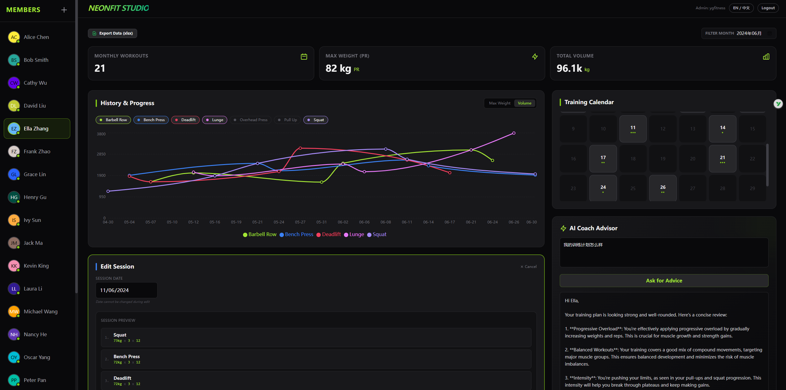

<div align="center">
  
</div>

# 🚀 NeonFit Studio Manager

**NeonFit Studio Manager** 是一款专为私人健身工作室打造的、支持中英双语的高端管理仪表盘。它集成了 Gemini AI 智能教练，为会员提供专业的训练建议。

> [!NOTE]
> **项目状态**：本项目目前由开发者本人正在使用中，处于**持续优化迭代**阶段。
> 为了确保最佳的稳定性和功能性，我正在不断改进代码架构和用户体验。**优化完成后，我将再次公开分享给社区！**

## ✨ 核心特性

- 💎 **精美 UI**：基于 Zinc-950 的深色模式设计，配合 Lime-500 点缀，视觉效果极佳。
- 📊 **多维统计**：实时追踪本月训练次数、最大重量突破（PR）及总训练容量。
- 🗓️ **训练日历**：直观展示历史训练分布，支持一键加载历史记录进行编辑。
- 🤖 **AI 智能教练**：深度整合 Gemini AI，基于会员真实的训练历史提供个性化指导。
- 🌍 **双语支持**：无缝切换中英文界面。
- ☁️ **云端同步**：基于 Supabase 构建，数据实时同步，安全可靠。

## 🛠️ 技术栈

- **前端**: React 19 + TypeScript + Vite
- **样式**: Tailwind CSS (CDN) + Vanilla CSS
- **后端/数据库**: Supabase (PostgreSQL)
- **AI 能力**: Google Gemini AI
- **图表**: Recharts

## 📥 本地运行

1. **安装依赖**:
   ```bash
   npm install
   ```
2. **配置环境变量**:
   在项目根目录创建 `.env.local` 文件，并填入您的密钥：
   ```env
   VITE_SUPABASE_URL=您的_SUPABASE_URL
   VITE_SUPABASE_ANON_KEY=您的_SUPABASE_ANON_KEY
   VITE_GEMINI_API_KEY=您的_GEMINI_API_KEY
   ```
3. **启动开发服务器**:
   ```bash
   npm run dev
   ```

---

感谢您的关注！请耐心等待正式版本的发布。
